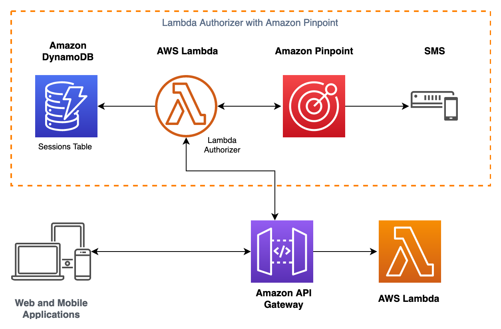

## Amazon API Gateway Pinpoint OTP Demo
This application demonstrates how you can leverage Amazon Pinpoint's One Time Password (OTP) feature, to authenticate Amazon API Gateway requests. It uses a Lambda Authorizer to authenticate incoming requests, and calls the `SendOTPMessage` and `VerifyOTPMessage` APIs in Amazon Pinpoint to validate OTPs and exchange the verification for an API key.

**NOTE:** This application is a demo, intended to help you validate ideas and perform a proof-of-concept. It is _not_ meant for production deployments as is.

## Requirements

- AWS Serverless Application Model (AWS SAM) Command Line Interface (CLI) to deploy to your account. Instructions for installing and setting up SAM CLI can be found [here](https://aws.amazon.com/serverless/sam/).
- Amazon Pinpoint project to send SMS OTP messages. Follow the [instructions](https://docs.aws.amazon.com/pinpoint/latest/userguide/channels-sms-setup.html) to configure your project.
- If the SMS channel on Amazon Pinpoint is not enabled for your `SenderID`, leverage the [SMS sandbox](https://docs.aws.amazon.com/pinpoint/latest/userguide/channels-sms-sandbox.html).
- Replace the `PINPOINT_APPLICATION_ID` variables in the [template](template.yaml) file before deployment. This identifier is displayed as the Project ID on the Amazon Pinpoint console.
- Optionally, replace the `BRAND_NAME` variable with a name of your choosing.

## Deployment

- Once the above requirements are met, deploy the application using `sam deploy --guided`
- Optionally you can browse to the AWS CloudFormation console to view the resources in more detail
- Note down the Amazon API Gateway endpoint - it will be used to invoke the APIs in the next step.

## Demo

- Make a `GET /`call without passing any headers. It should return with a `403` forbidden error.
- Next call the `POST /login` API and pass the `Phone` header with the recepient phone number. You should receive the OTP code as SMS.
- Next call the `POST /verify` API and pass the `Phone` and `Otp` headers. In the API response you should receive an API token.
- Lastly, call the `GET /` API again, and pass the `Authorization` header with the API token from previous step. You API call should return with a `200` response.

## Cleanup

- Use `sam delete` to delete the application from your AWS account, and avoid incurring additional charges.
- Note: The above command does not delete any components that you create manually.

## Security

See [CONTRIBUTING](CONTRIBUTING.md#security-issue-notifications) for more information.

## License

This library is licensed under the MIT-0 License. See the LICENSE file.
